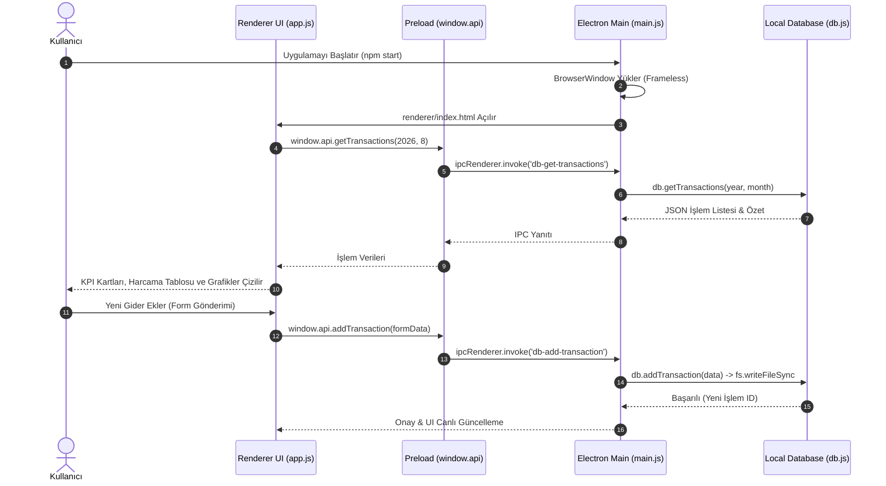

# TEKNİK SİSTEM DOKÜMANTASYONU VE MÜHENDİSLİK RAPORU

**Proje Adı:** FinTrack — Modern Masaüstü Gelir/Gider ve Masraf Takip Uygulaması  
**Dizin:** `C:\Users\ardab\.gemini\antigravity\scratch\fintrack`  
**GitHub Deposu:** [https://github.com/Bleezbub/Butce-Panosu-Uygulamas-](https://github.com/Bleezbub/Butce-Panosu-Uygulamas-)  
**Web Versiyonu Deposu:** [https://github.com/Bleezbub/Budget-Dashboard](https://github.com/Bleezbub/Budget-Dashboard)  
**Proje Tipi:** Electron.js Tabanlı Yerel Masaüstü Finans Uygulaması (Cross-Platform Desktop App)  
**Tarih:** 13 Ağustos 2026  
**Doküman Versiyonu:** v1.0.0  

---

## 1. PROJE ÖZETİ & DETAYLI AMACI

### 1.1 Proje Tanımı
**FinTrack**, Node.js ve Electron.js mimarisi üzerine inşa edilmiş, çerçevesiz (frameless) modern koyu temalı arayüze sahip, tamamen çevrimdışı (offline-first) çalışan ve kişisel harcamaları/gelirleri yerel veritabanında saklayan **profesyonel bir masaüstü finans ve bütçe yönetim uygulamasıdır**. Bu proje, tarayıcı tabanlı `Budget-Dashboard` web platformunun doğrudan bilgisayara kurulabilir bağımsız masaüstü sürümüdür.

### 1.2 Hedeflenen Problem ve Temel İşlevler
* **Yerel ve Güvenli Veri Depolama (Zero-Cloud / Offline-First):** Finansal verilerin bulut sunucularına aktarılmasına gerek kalmadan, kullanıcının kendi bilgisayarında izole yerel dosya tabanlı veritabanında (`database/db.js`) saklanması.
* **Modern Çerçevesiz Masaüstü Deneyimi (Frameless Window UX):** Standart işletim sistemi pencere başlıkları yerine özel minimize, maksimize ve kapatma kontrollerine sahip, modern karanlık arayüz (Dark Glassmorphism) sunumu.
* **İşlem ve Kategori Yönetimi:** Gelir ve giderleri tarih, kategori, ödeme türü ve açıklamalarıyla kaydetme; aylık harcama limitleri tanımlama.
* **Gelişmiş IPC İletişim Güvenliği:** `contextIsolation: true` ve `nodeIntegration: false` güvenlik standartlarına tam uyumlu, `preload.js` ve `contextBridge` üzerinden güvenli çift yönlü süreçler arası iletişim (Inter-Process Communication).

---

## 2. TEKNOLOJİ YIĞINI & MİMARİ KATMANLARI

Sistem, masaüstü işletim sistemi API'leri ile modern web ön yüz standartlarının entegre çalıştığı çok katmanlı bir mimariye sahiptir:

| Katman | Teknoloji / Kütüphane | Versiyon / Standart | Görev / Kullanım Amacı |
| :--- | :--- | :--- | :--- |
| **Masaüstü Çalışma Ortamı** | Electron.js | v29.1+ | Yerel pencere yönetimi, işletim sistemi bildirimleri ve yaşam döngüsü |
| **Çalışma Zamanı (Runtime)** | Node.js | v18+ / v20+ | Yerel dosya sistemi (fs), yol yönetimi (path) ve veritabanı I/O |
| **Süreçler Arası İletişim** | Electron IPC & ContextBridge | W3C / Electron API | Ana Süreç (Main) ile Arayüz (Renderer) arasında güvenli köprü |
| **Veritabanı Katmanı** | Yerel Veritabanı Motoru (`db.js`)| JSON / File Storage | İşlem kayıtları, kategoriler, bütçe limitleri ve özet hesaplamaları |
| **Ön Yüz (Renderer UI)** | HTML5, CSS3, Vanilla JS | ES6+ Standart | Dashboard paneli, harcama grafikleri, modal formlar |
| **Tasarım & UI Sistemi** | Dark Glassmorphism | CSS3 Variables | `#0d0d0f` arka plan, akıcı geçişler, özel kaydırma çubukları |

---

## 3. SİSTEM MİMARİSİ VE ÇALIŞMA MEKANİZMASI

### 3.1 Süreçler Arası İletişim Mimarisi (Main vs. Renderer Process)

Electron uygulamaları iki temel süreç katmanında çalışır:

```
+-----------------------------------------------------------------------------+
| 1. MAIN PROCESS (Node.js Ortamı - main.js)                                  |
|   - BrowserWindow oluşturur (1280x800, frameless).                         |
|   - ipcMain.handle() ile veritabanı isteklerini karşılar.                  |
|   - Doğrudan dosya sistemi (fs) ve veritabanı (db.js) ile iletişim kurar.  |
+---------------------------------------+-------------------------------------+
                                        | (IPC Message Passing)
+---------------------------------------v-------------------------------------+
| 2. PRELOAD SCRIPT (Köprü Katmanı - preload.js)                              |
|   - contextBridge.exposeInMainWorld('api', { ... })                        |
|   - Renderer sürecine yalnızca izin verilen güvenli API fonksiyonlarını sunar|
+---------------------------------------+-------------------------------------+
                                        | (window.api Çağrıları)
+---------------------------------------v-------------------------------------+
| 3. RENDERER PROCESS (Ön Yüz - renderer/index.html & app.js)                |
|   - DOM render işlemleri, grafik çizimleri, kullanıcı form etkileşimleri.   |
|   - window.api.getTransactions() gibi fonksiyonlarla verileri talep eder.  |
+-----------------------------------------------------------------------------+
```

### 3.2 Sıralama Şeması (Mermaid Sequence Diagram)



---

## 4. KOD YAPISI VE TEKNİK İNCELEME

### 4.1 Proje Dizin Ağacı
```
fintrack/
├── .gitignore                # Git dışlama kuralları (node_modules, build)
├── package.json              # Uygulama manifestosu ve başlatma betikleri
├── package-lock.json         # Kilitli bağımlılık ağacı
├── main.js                   # Electron ana süreci ve IPC dinleyicileri
├── preload.js                # Güvenli ContextBridge API tanımlamaları
├── database/                 # Veritabanı ve veri kalıcılık modülü
│   └── db.js                 # CRUD operasyonları ve bütçe hesaplamaları
└── renderer/                 # Masaüstü ön yüz dosyaları
    ├── index.html            # Çerçevesiz masaüstü arayüz iskeleti
    ├── style.css             # Glassmorphism koyu tema CSS kuralları
    └── app.js                # İstemci tarafı olay yöneticisi ve DOM güncelleyici
```

---

### 4.2 Kritik Kod Blokları ve Teknik Analizleri

#### A. Çerçevesiz Pencere ve Güvenli Preload Yapılandırması (`main.js`)
```javascript
// main.js (Satır 7 - 24)
function createWindow() {
  mainWindow = new BrowserWindow({
    width: 1280,
    height: 800,
    minWidth: 900,
    minHeight: 650,
    frame: false,             // İşletim sistemi standart çerçevesini kaldırır
    backgroundColor: '#0d0d0f',
    titleBarStyle: 'hidden',  // Modern macOS ve Windows başlık çubuğu stili
    webPreferences: {
      preload: path.join(__dirname, 'preload.js'),
      contextIsolation: true, // Arayüzü Node.js çekirdeğinden izole eder
      nodeIntegration: false, // XSS ve güvenlik açıklarını önler
    },
    show: false,
  });

  mainWindow.loadFile(path.join(__dirname, 'renderer', 'index.html'));
  mainWindow.once('ready-to-show', () => mainWindow.show()); // Beyaz ekran parlamasını önler
}
```

---

#### B. ContextBridge ile Güvenli API İzolasyonu (`preload.js`)
```javascript
// preload.js
const { contextBridge, ipcRenderer } = require('electron');

contextBridge.exposeInMainWorld('api', {
  // Pencere Kontrolleri
  minimize: () => ipcRenderer.send('window-minimize'),
  maximize: () => ipcRenderer.send('window-maximize'),
  close: () => ipcRenderer.send('window-close'),

  // Veritabanı CRUD Metotları
  getTransactions: (y, m) => ipcRenderer.invoke('db-get-transactions', y, m),
  addTransaction: (data) => ipcRenderer.invoke('db-add-transaction', data),
  deleteTransaction: (id) => ipcRenderer.invoke('db-delete-transaction', id),
  getSummary: (y, m) => ipcRenderer.invoke('db-get-summary', y, m),
});
```

---

## 5. PROJE NASIL BAŞLATILIR? (ADIM ADIM KURULUM & ÇALIŞTIRMA)

### 5.1 Ön Gereksinimler (Prerequisites)
1. **Node.js:** Node.js v18.0.0 veya üzeri bir sürüm kurulu olmalıdır (`node -v` ile test edin).
2. **NPM:** Paket yöneticisi (`npm -v`).

---

### 5.2 Adım Adım Kurulum (Setup)

1. **Proje Dizinine Geçin:**
   ```powershell
   cd C:\Users\ardab\.gemini\antigravity\scratch\fintrack
   ```

2. **Bağımlılıkları Yükleyin:**
   ```powershell
   npm install
   ```

---

### 5.3 Uygulamayı Masaüstünde Başlatma (Start Execution)

#### Standart Masaüstü Modunda Başlatma:
```powershell
npm start
```

#### Geliştirici (DevTools) Modunda Başlatma:
```powershell
npm run dev
```

*Komut çalıştırıldığında FinTrack masaüstü penceresi doğrudan ekranda açılır.*

---

## 6. KAPSAMLI KULLANIM KILAVUZU & WORKFLOW

### 6.1 Arayüz ve Özellik Rehberi

1. **Pencere Kontrolleri (Window Controls):** Sağ üst köşede yer alan özel butonlarla pencere simge durumuna küçültülebilir (`—`), tam ekran yapılabilir (`□`) veya kapatılabilir (`✕`).
2. **Gelir / Gider Girişi:**
   * **"+ Yeni İşlem"** butonuna basın.
   * Tarih, tür (Gelir/Gider), Kategori (Market, Kira, Fatura, Maaş vb.), Tutar ve Açıklama girerek kaydedin.
3. **Aylık Masraf Analizi:**
   * Üst navigasyon barından Ay ve Yıl seçimi yaparak geçmiş dönemlerin harcama dökümlerini ve kategori dağılım grafiklerini inceleyin.
4. **Bütçe ve Limit Takibi:**
   * Belirli kategoriler için aylık harcama limitleri tanımlayarak bütçe aşımı durumunda görsel uyarılar alın.

---

### 6.2 Olası Sorunlar ve Çözüm Rehberi (Troubleshooting)

* **Electron Penceresi Açılmıyor / Node Modules Hatası:** `node_modules` klasörünü silip `npm install` komutunu yeniden çalıştırın.
* **Pencere Çerçevesi Sürüklenemiyor:** CSS üzerinde üst başlık alanına `-webkit-app-region: drag;` ve butonlara `-webkit-app-region: no-drag;` kurallarının uygulandığından emin olun.
