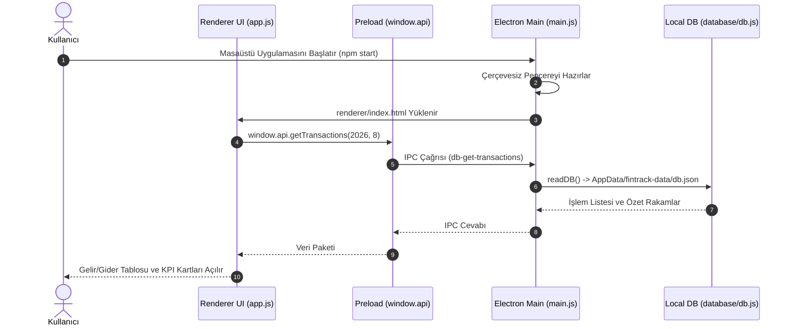

# TEKNİK SİSTEM DOKÜMANTASYONU VE KULLANIM KILAVUZU

**Proje Adı:** FinTrack — Modern Masaüstü Gelir/Gider ve Masraf Takip Uygulaması  
**Dizin:** `C:\Users\ardab\.gemini\antigravity\scratch\6bütce-panosu-uygulaması`  
**GitHub Deposu:** [https://github.com/Bleezbub/Butce-Panosu-Uygulamas-](https://github.com/Bleezbub/Butce-Panosu-Uygulamas-)  
**Web Sürümü Deposu:** [https://github.com/Bleezbub/Budget-Dashboard](https://github.com/Bleezbub/Budget-Dashboard)  
**Proje Tipi:** Electron.js Tabanlı Yerel Masaüstü Finans Yazılımı (Cross-Platform Desktop App)  
**Tarih:** 13 Ağustos 2026  
**Doküman Versiyonu:** v1.0.0  

---

## 1. PROJE ÖZETİ & DETAYLI AMACI

### 1.1 Proje Tanımı
**FinTrack**, Node.js ve Electron.js mimarisi üzerine inşa edilmiş, modern koyu temalı (Dark Glassmorphism) ve çerçevesiz (frameless) arayüze sahip, tamamen çevrimdışı (offline-first) çalışan ve kişisel bütçeyi yerel veritabanında saklayan **bağımsız bir masaüstü finans yazılımıdır**. Bu uygulama, tarayıcı tabanlı `Budget-Dashboard` projesinin bilgisayara doğrudan kurulan profesyonel masaüstü versiyonudur.

### 1.2 Hedeflenen Problem ve Temel İşlevler
* **Mutlak Veri Gizliliği (Zero-Cloud / Offline-First):** Finansal bilgilerinizi üçüncü parti uzak sunuculara göndermez; tüm gelir, gider ve bütçe verilerini bilgisayarınızın yerel işletim sistemi dizininde (`%APPDATA%`) şifresiz/güvenli olarak saklar.
* **Modern Masaüstü Pencere Deneyimi (Frameless Window):** İşletim sisteminin eski pencereleri yerine özel minimize, maksimize ve kapatma butonlarına sahip modern karanlık bir çalışma alanı sunar.
* **Kategori ve Bütçe Takibi:** Harcamaları ana/alt kategorilere ayırma, kredi kartı ekstrelerini ve son ödeme tarihlerini takip etme, aylık bütçe limitleri koyarak aşım uyarıları alma.
* **Güvenli Süreçler Arası İletişim (IPC):** `contextIsolation: true` ve `nodeIntegration: false` güvenlik standartlarına tam uyumlu `preload.js` köprüsü üzerinden çalışır.

---

## 2. TEKNOLOJİ YIĞINI & MİMARİ KATMANLARI

| Katman | Teknoloji / Kütüphane | Versiyon / Standart | Görev / Kullanım Amacı |
| :--- | :--- | :--- | :--- |
| **Masaüstü Motoru** | Electron.js | v29.1+ | Yerel pencere yönetimi, masaüstü yaşam döngüsü |
| **Çalışma Zamanı (Runtime)** | Node.js | v18+ / v20+ (LTS) | Yerel dosya sistemi (fs) ve veritabanı I/O yönetimi |
| **Süreçler Arası İletişim** | Electron IPC & ContextBridge | Standart API | Ana Süreç (Main) ile Arayüz (Renderer) arasında güvenli köprü |
| **Yerel Veritabanı** | JSON File Database Engine | `database/db.js` | Native derleme gerektirmeyen, sıfır bağımlılıklı yerel veri motoru |
| **Ön Yüz (Renderer UI)** | HTML5, CSS3, Vanilla JS | ES6+ Standart | Koyu Glassmorphism arayüz, KPI kartları, dinamik grafikler |

---

## 3. SİSTEM MİMARİSİ VE ÇALIŞMA MEKANİZMASI

### 3.1 Süreçler Arası İletişim (IPC) Modeli

```
+-----------------------------------------------------------------------------+
| 1. MAIN PROCESS (Node.js Çekirdeği - main.js)                               |
|   - 1280x800 ebatlarında çerçevesiz masaüstü penceresi oluşturur.           |
|   - ipcMain.handle() ile veritabanı okuma/yazma isteklerini karşılar.       |
|   - Bilgisayarın yerel AppData dizinindeki db.json dosyasını yönetir.       |
+---------------------------------------+-------------------------------------+
                                        | (IPC Message Passing)
+---------------------------------------v-------------------------------------+
| 2. PRELOAD SCRIPT (Güvenlik Köprüsü - preload.js)                          |
|   - contextBridge.exposeInMainWorld('api', { ... })                        |
|   - Ön yüzün doğrudan Node.js çekirdeğine erişmesini engelleyerek izole eder|
+---------------------------------------+-------------------------------------+
                                        | (window.api Metotları)
+---------------------------------------v-------------------------------------+
| 3. RENDERER PROCESS (Görsel Arayüz - renderer/index.html & app.js)          |
|   - window.api.getTransactions() çağrısı ile verileri ekrana çizer.         |
|   - Form gönderimlerini window.api.addTransaction() ile veritabanına iletir.|
+-----------------------------------------------------------------------------+
```

### 3.2 Sıralama Şeması (Mermaid Sequence Diagram)



---

## 4. İNDİRME VE SIFIRDAN BAŞLATMA REHBERİ (ADIM ADIM)

Bu projeyi GitHub'dan indiren bir kullanıcının uygulamayı **sıfır hata ile** başlatması için gereken her şey aşağıda listelenmiştir:

### 4.1 Nelerin Yüklenmesi Gerekiyor ve Neden?

| Gereksinim | Neden Gereklidir? | Nereden İndirilir? |
| :--- | :--- | :--- |
| **Node.js (LTS Sürümü)** | JavaScript kodlarının tarayıcı dışında, bilgisayarınızda bir masaüstü yazılımı gibi çalışmasını sağlayan ana motordur. | [https://nodejs.org](https://nodejs.org) *(LTS sürümünü indirip kurun)* |
| **NPM (Paket Yöneticisi)** | Projenin masaüstü pencere motoru olan Electron.js kütüphanesini tek tıkla indirmek için gereklidir *(Node.js kurulduğunda otomatik kurulur)*. | Node.js ile birlikte gelir |

---

### 4.2 Adım 1: Projeyi Bilgisayarınıza İndirin

* **Seçenek A (ZIP Olarak İndirme):**  
  GitHub sayfasındaki yeşil **"Code"** butonuna tıklayın ve **"Download ZIP"** seçeneğini seçin. İndirdiğiniz `.zip` dosyasını masaüstünde veya istediğiniz bir klasörde dışarı çıkartın.
* **Seçenek B (Git Clone İle):**  
  ```bash
  git clone https://github.com/Bleezbub/Butce-Panosu-Uygulamas-.git
  cd Butce-Panosu-Uygulamas-
  ```

---

### 4.3 Adım 2: Proje Klasöründe Terminali Açın

1. Projenin bulunduğu klasörü açın.
2. Klasörün boş bir yerine `Shift` tuşuna basılı tutarak **Sağ Tıklayın** ve **"PowerShell Penceresini Burada Aç"** (veya *"Terminalde Aç"*) seçeneğine tıklayın.  
   *(Veya klasörün üstteki adres çubuğuna `cmd` yazıp Enter'a basın).*

---

### 4.4 Adım 3: Gerekli Kütüphaneleri İndirin (`npm install`)

Terminal ekranına şu komutu yazıp Enter'a basın:
```bash
npm install
```
* **Neden Bu Komutu Yazıyoruz?** Bu komut, `package.json` dosyasını okuyarak uygulamanın masaüstünde pencere olarak açılmasını sağlayan **Electron.js** motorunu otomatik olarak indirir. İndirme sadece 1 kez yapılır.

---

### 4.5 Adım 4: Uygulamayı Başlatın (`npm start`)

İndirme tamamlandıktan sonra uygulamayı başlatmak için:
```bash
npm start
```
* **Sonuç:** FinTrack masaüstü uygulaması saniyeler içinde ekranınızda bağımsız bir pencere olarak açılacaktır! 🎉

---

## 5. KAPSAMLI KULLANIM KILAVUZU & WORKFLOW

### 5.1 Arayüzün Kullanımı ve Özellikler

1. **Pencereyi Taşıma ve Boyutlandırma:**
   * Çerçevesiz tasarım nedeniyle pencerenin en üstündeki siyah başlık çubuğundan tutarak pencereyi ekranın istediğiniz yerine taşıyabilirsiniz.
   * Sağ üstteki butonlar:
     * `—` : Pencereyi görev çubuğuna küçültür (Minimize).
     * `□` : Pencereyi tam ekran yapar veya eski boyutuna getirir (Maximize).
     * `✕` : Uygulamayı tamamen kapatır (Close).
2. **Yeni Gelir / Gider Ekleme:**
   * Sol menüdeki veya üst bardaki **"+ Yeni İşlem Ekle"** butonuna basın.
   * Türü seçin (Gelir veya Gider).
   * Kategori belirleyin (Market, Kira, Fatura, Maaş, Ulaşım vb.).
   * Tutar ve açıklama girerek **Kaydet** butonuna basın. İşlem anında tabloya ve grafiklere yansır.
3. **Kredi Kartı ve Ekstre Takibi:**
   * Kredi kartı sekmesinden banka adını, kart limitini ve son ödeme tarihini girerek yaklaşan borçlarınızı takip edin.
4. **Bütçe Limitleri ve Tasarruf Hedefleri:**
   * Belirli kategorilere aylık tavan harcama limiti koyun. Limit aşıldığında sistem arayüzde kırmızı uyarı rozetleri gösterir.

---

### 5.2 Verilerim Nerede Saklanıyor? (Veri Güvenliği ve Yedekleme)

Uygulama, verilerinizi bilgisayarınızın işletim sistemi standart uygulama verisi klasöründe saklar:
* **Windows Dosya Yolu:**  
  `C:\Users\KULLANICI_ADINIZ\AppData\Roaming\fintrack\fintrack-data\db.json`
* **Mac Dosya Yolu:**  
  `~/Library/Application Support/fintrack/fintrack-data/db.json`
* **Yedek Alma / Yeni Bilgisayara Aktarma:**  
  Yukarıdaki `db.json` dosyasını kopyalayıp başka bir bilgisayara aktararak tüm harcama geçmişinizi sıfır kayıpla taşıyabilirsiniz.

---

## 6. SIK KARŞILAŞILAN SORUNLAR VE ÇÖZÜMLERİ (TROUBLESHOOTING)

### Soru 1: `'node' veya 'npm' is not recognized / iç ya da dış komut olarak tanınmıyor` hatası alıyorum?
* **Çözüm:** Bilgisayarınızda Node.js kurulu değildir. [https://nodejs.org](https://nodejs.org) adresine gidip **LTS** sürümünü indirip kurun. Kurulum bittikten sonra açık olan terminalinizi kapatıp yeniden açın.

### Soru 2: PowerShell'de `PSSecurityException / Script çalıştırma devre dışı` hatası alıyorum?
* **Çözüm:** Windows PowerShell varsayılan güvenlik kuralından kaynaklanır. PowerShell'i açıp şu komutu çalıştırarak izin verin:
  ```powershell
  Set-ExecutionPolicy -Scope Process -ExecutionPolicy Bypass
  ```
  Ardından `npm start` komutunu tekrar çalıştırın.

### Soru 3: Uygulamayı kapattığımda verilerim silinir mi?
* **Çözüm:** Hayır! Veritabanı dosya sisteminde (`db.json`) kalıcı olarak saklanır. Bilgisayarınızı yeniden başlatsanız dahi tüm geçmişiniz korunur.
